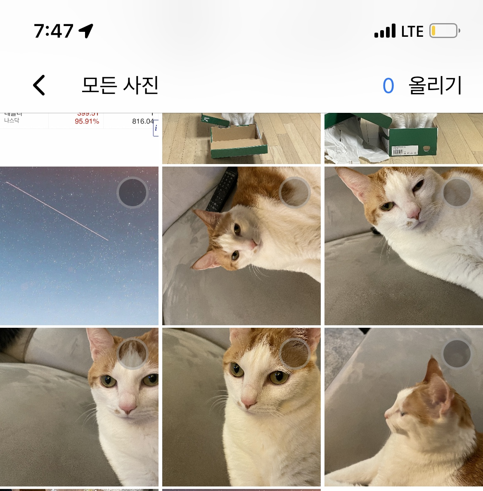
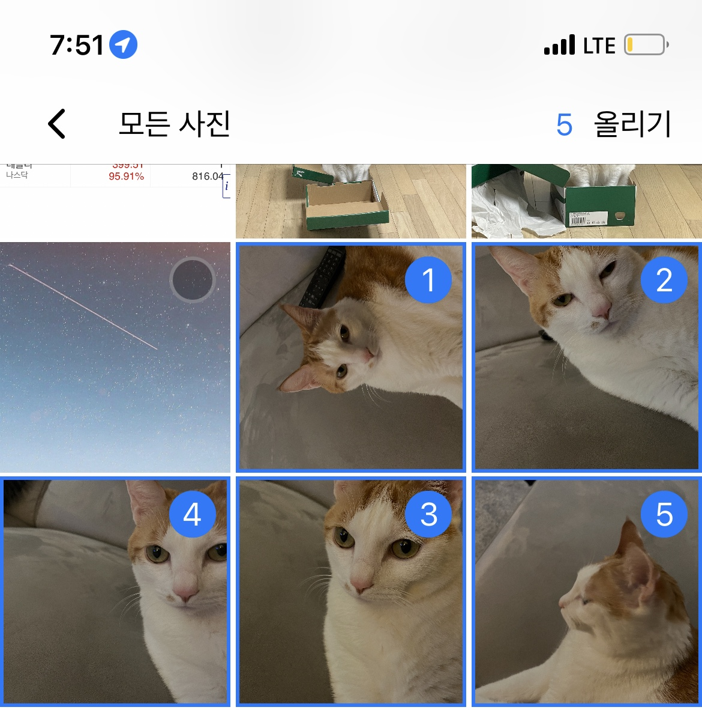

# MPHPicker
## 요약
iOS 사진 다중 선택을 위한 라이브러리입니다. 기본적인 UI는 당근마켓에서 사진 추가 버튼 클릭시 보이는 UI와 최대한 동일한 화면으로 만들었습니다.
---
## 실제 사용시
### 사진 선택 전


### 사진 선택 후

---
## 사용을 위한 예제 코드
### MPHPickerExmaple/SceneDelegate.swift
```swift
        // SceneDelegate에 선언한 건 다른 화면 없이 MPHNavigatonController를 루트 뷰로 하기 위해서 입니다.
        // 다른 이유는 없습니다.
        // MPHNavigatonController는 네비게이션 영역까지 정의된 화면입니다.
        let rootViewController = MPHNavigationController()
        rootViewController.setMPHUploadDelegete(self)
        
        
        self.window?.rootViewController = rootViewController
        self.window?.makeKeyAndVisible()
```
### 일반적인 사용시
```swift
let mphNaviVC = MPHNavigatonController()
mphNaviVC
  .setMPHUploadDelegate(self)
  .setImageGridViewDelegate(self)
  // setMPHUploadDelegate
  // MPHUploadDelegate는 네비게이션바 우측 버튼에 대한 액션을 정의합니다.
  // delegate는  func willUploadSelectedImageAssets() 를 구현해야 합니다.
  
  // setImageGridViewDelegate
  // 지정한 최대 사진 갯수 이상을 선택했을 때의 액션을 정의합니다.
  // delegate는 반드시 didFillUpAssets를 구현해야 합니다.
  // present 로 사용해야 합니다.
  self.presnet(mphNaviVC)
// navigationController에 푸쉬 하려면 MPHGridViewController를 사용해야 합니다. 설명은 나주에 추가하겠습니다.
```
